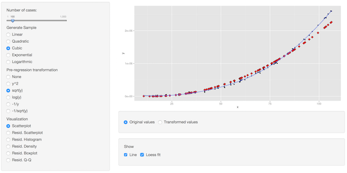
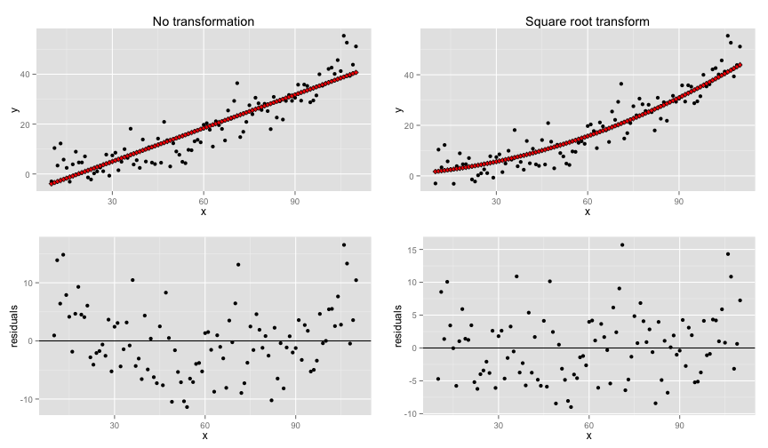

LR Visualizer
========================================================
author: Michael Lyubinin
date: 10/25/2014

[mlyubinin.shinyapps.io/lr_visualizer](http://mlyubinin.shinyapps.io/lr_visualizer)

Why
========================================================

- Linear Regression is overused
  + Default in spreadsheets, Tableau and other tools
- Linear Regression is underused
  + After one look at non-linear association many run to other methods
- We need help to understand where LR can be a good fit
- Playing with interactive graphs is fun
- Hence, LR Visualizer

What
========================================================

- Generate 2-feature samples with somewhat randomized association:
  + Linear, Quadratic, Cubic, Exponential, Logarithmic
- Plot the sample
- Create LR
  + Examine fit
  + Look at distribution of residuals
  + Compare with Loess fit
  
But wait, there's more
========================================================

- Transform the sample
  + y^2 , $\sqrt{y}$, ln(y), -$\frac{1}{y}$, -$\frac{1}{\sqrt{y}}$
- Create LR on transformed sample
- Show LR on both transfomed and original sample
- Examine fit and residuals after reverse transform of $\hat{y}$

Example - LR of quadratic association
========================================================
 
